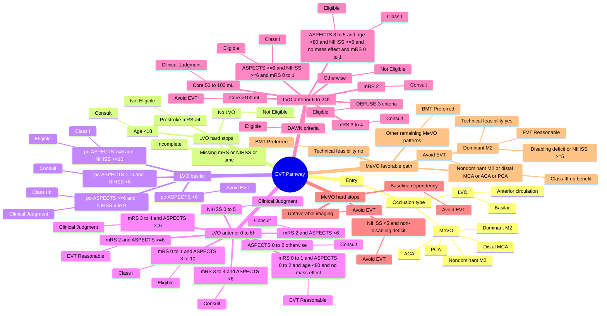
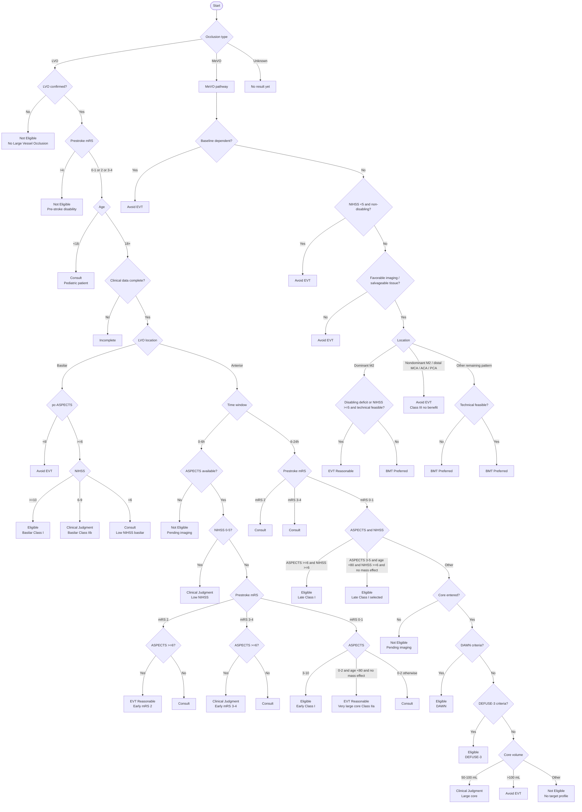

# EVT Pathway Mind Map and Flow Chart

Source of truth: [src/pages/EvtPathway.tsx](/Users/vaibhav/Documents/NeuroWiki/Cursor/Neurowiki/neurowiki/src/pages/EvtPathway.tsx)

These diagrams reflect the current coded logic in the EVT pathway, not a simplified textbook version.

## Mind Map

## Flow Chart

## Current Thinking Rationale

- The first split is by occlusion type: the component runs either `calculateLvoProtocol` or `calculateMevoProtocol`.
- LVO and MeVO are intentionally asymmetric:
  - LVO has formal early and late-window Class I and consultation branches.
  - MeVO is conservative and mostly defaults to avoidance or best medical therapy unless the case is a selected dominant M2 pattern.
- Basilar LVO is handled separately from anterior LVO and uses `pc-ASPECTS`, not ASPECTS/core mismatch.
- Early anterior LVO prioritizes simple ASPECTS-based rules before any perfusion-style logic.
- Late anterior LVO prioritizes the new 2026 ASPECTS-based Class I branches before the older DAWN and DEFUSE-3 perfusion/core mismatch branches.
- In late anterior LVO:
  - `mRS 2` and `mRS 3-4` are coded as `Consult`, even before imaging-derived late-window approval paths.
  - ASPECTS `>=6` with NIHSS `>=6` is an immediate Class I approval.
  - ASPECTS `3-5` for selected patients is also an immediate Class I approval.
  - DAWN and DEFUSE-3 only become relevant if those ASPECTS-driven branches do not trigger.
- MeVO logic is effectively a filter stack:
  - remove dependency
  - remove low-NIHSS non-disabling cases
  - remove unfavorable imaging
  - allow selected dominant M2 if deficit is significant and anatomy is technically feasible
  - otherwise prefer BMT or avoid EVT

## Implementation Notes

- The result model can return `Eligible`, `EVT Reasonable`, `Clinical Judgment`, `Consult`, `BMT Preferred`, `Avoid EVT`, `Not Eligible`, or `Incomplete`.
- `eligible: true` is used for both strong recommendations and some softer pathways like `Clinical Judgment` or `EVT Reasonable`.
- The UI is sectioned as `Triage -> Clinical -> Imaging -> Decision`, but the real decision engine is the two calculators:
  - LVO: [calculateLvoProtocol](/Users/vaibhav/Documents/NeuroWiki/Cursor/Neurowiki/neurowiki/src/pages/EvtPathway.tsx#L140)
  - MeVO: [calculateMevoProtocol](/Users/vaibhav/Documents/NeuroWiki/Cursor/Neurowiki/neurowiki/src/pages/EvtPathway.tsx#L381)
