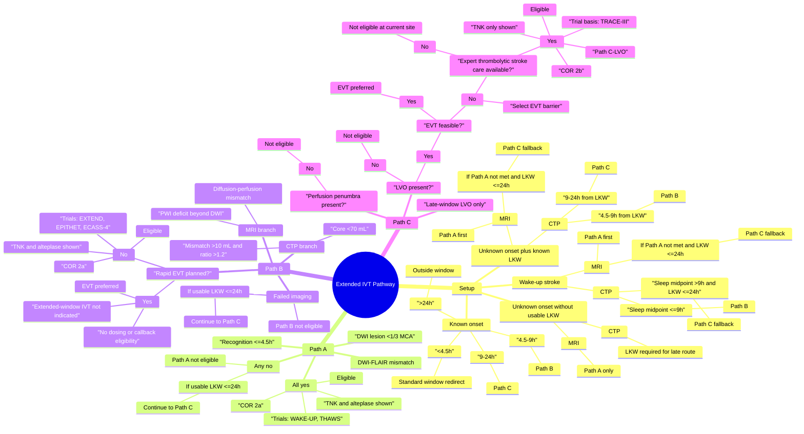

# Extended IVT Pathway Mind Map and Flow Chart

Source of truth: [src/pages/ExtendedIVTPathway.tsx](/Users/vaibhav/Documents/NeuroWiki/Cursor/Neurowiki/neurowiki/src/pages/ExtendedIVTPathway.tsx)

These diagrams reflect the logic currently implemented in code after the guideline-alignment refactor. They describe the calculator's actual routing and rationale, including sequential fallback from early unknown-onset branches into late-window LVO assessment.

## Mind Map



## Flow Chart

```mermaid
flowchart TD
    A([Start]) --> B{Setup complete and imaging selected?}
    B -->|No| Z0[No result yet]
    B -->|Yes| C{Onset mode}

    C -->|Known onset| D{Elapsed from LKW}
    D -->|<4.5h| S1[Standard Window\nUse standard IVT pathway]
    D -->|4.5-9h| PBB[Path B]
    D -->|9-24h| PCC[Path C]
    D -->|>24h| O1[Outside Window\nNot eligible]

    C -->|Unknown plus known LKW| U1{Imaging}
    U1 -->|MRI| PAA[Path A]
    U1 -->|CTP| U2{Elapsed from LKW}
    U2 -->|4.5-9h| PBB
    U2 -->|9-24h| PCC
    U2 -->|<4.5h| S1
    U2 -->|>24h| O1

    C -->|Unknown no usable LKW| N1{Imaging}
    N1 -->|MRI| PAA
    N1 -->|CTP| L1[LKW Required\nCTP cannot route late pathway]

    C -->|Wake-up stroke| W1{Imaging}
    W1 -->|MRI| PAA
    W1 -->|CTP| W2{Sleep midpoint <=9h?}
    W2 -->|Yes| PBB
    W2 -->|No| W3{LKW <=24h?}
    W3 -->|Yes| PCC
    W3 -->|No| O1

    PAA --> A1{Recognition <=4.5h?}
    A1 -->|No| A4{Usable LKW <=24h?}
    A1 -->|Yes| A2{DWI lesion <1/3 MCA?}
    A2 -->|No| A4
    A2 -->|Yes| A3{DWI-FLAIR mismatch?}
    A3 -->|No| A4
    A3 -->|Yes| AOK[Eligible\nPath A\nCOR 2a\nWAKE-UP + THAWS]
    A4 -->|Yes| PCC
    A4 -->|No| A_N[Not Eligible\nPath A failed and no late fallback]

    PBB --> B0{Imaging branch}
    B0 -->|CTP| B1{Core <70 mL?}
    B1 -->|No| B4{Usable LKW <=24h?}
    B1 -->|Yes| B2{Mismatch >10 mL and ratio >1.2?}
    B2 -->|No| B4
    B2 -->|Yes| B3{Rapid EVT planned?}

    B0 -->|MRI| B5{PWI deficit beyond DWI?}
    B5 -->|No| B4
    B5 -->|Yes| B6{Diffusion-perfusion mismatch?}
    B6 -->|No| B4
    B6 -->|Yes| B3

    B3 -->|Yes| B3Y[EVT Preferred\nExtended-window IVT not indicated]
    B3 -->|No| B3N[Eligible\nPath B COR 2a\nEXTEND + EPITHET + ECASS-4]
    B4 -->|Yes| PCC
    B4 -->|No| B_N[Not Eligible]

    PCC --> C1{Perfusion penumbra present?}
    C1 -->|No| C1N[Not Eligible\nNo salvageable penumbra]
    C1 -->|Yes| C2{LVO present?}

    C2 -->|No| C2N[Not Eligible\nPath C requires ICA or MCA (M1/M2) occlusion]
    C2 -->|Yes| C3{EVT feasible?}
    C3 -->|Yes| C3Y[EVT Preferred\nExtended-window IVT not indicated]
    C3 -->|No| C4{EVT barrier selected?}
    C4 -->|No| Z1[Incomplete]
    C4 -->|Yes| C5{Expert thrombolytic stroke care available?}
    C5 -->|No| C5N[Not Eligible at Current Site]
    C5 -->|Yes| C5Y[Eligible\nPath C-LVO COR 2b\nTRACE-III]
```

## Updated Thinking Rationale

- The calculator now uses explicit onset modes, not a single `lkwUnknown` flag. This separates:
  - known onset
  - unknown onset with usable LKW
  - unknown onset without usable LKW
  - wake-up stroke
- The routing is staged, not single-shot:
  - Path A is the first-pass unknown-onset MRI pathway.
  - Path B is the perfusion-selected 4.5–9 hour pathway.
  - Path C is a late fallback for patients still within 24 hours from LKW when the earlier branch does not apply or fails.
- Path C is now intentionally narrower:
  - ICA or MCA (M1/M2) occlusion is required.
  - salvageable penumbra is required.
  - EVT must not be feasible.
  - expert thrombolytic stroke care must be available.
- Path B no longer treats rapid EVT as bridge-IVT eligibility. If rapid thrombectomy is already planned, the calculator redirects to EVT and suppresses IVT dosing/callback eligibility.
- Path C uses `TRACE-III` for the positive late-window recommendation; `TIMELESS` informs the separate redirect away from extended-window IVT when rapid EVT is already available.
- Unknown-onset patients are no longer excluded from late-window assessment if a usable LKW exists. This is the main reason the resolver now supports Path A/B failure falling through into Path C.
- Unknown-onset patients without usable LKW remain eligible for MRI-based Path A, but CT perfusion alone cannot route them into the late-window branch.

## Implementation Notes

- Exported `IVTResult.path` is now limited to `A`, `B`, or `C-LVO`.
- The old `C-NonLVO` recommendation and `OPTION`-based late-path endorsement were removed from the calculator.
- Path C expertise now changes the outcome: `No` produces `Not Eligible at Current Site` rather than a positive recommendation.
- Path B evidence labels now use `EXTEND`, `EPITHET`, and `ECASS-4` in the result output.
